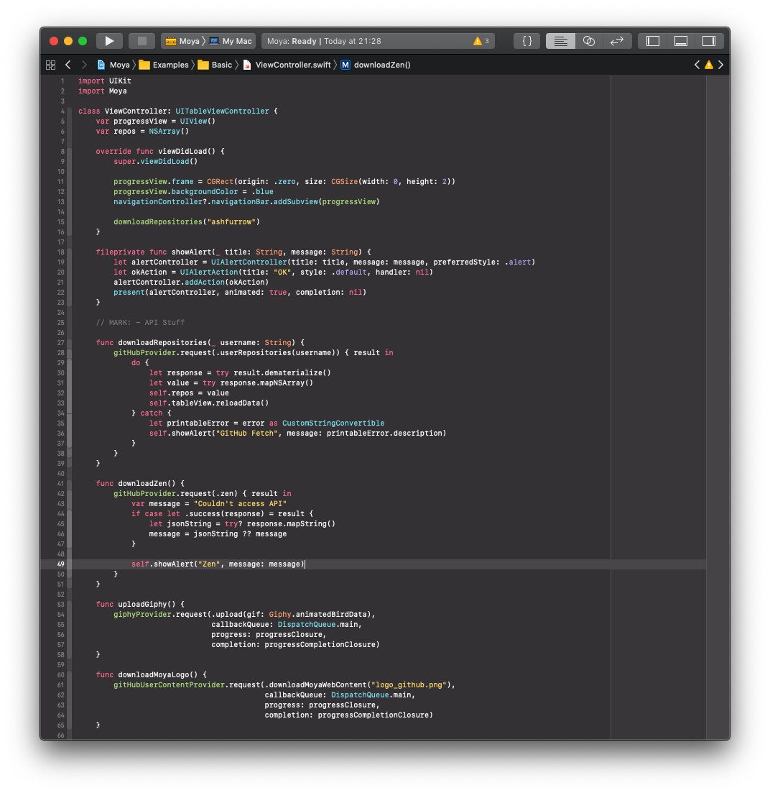
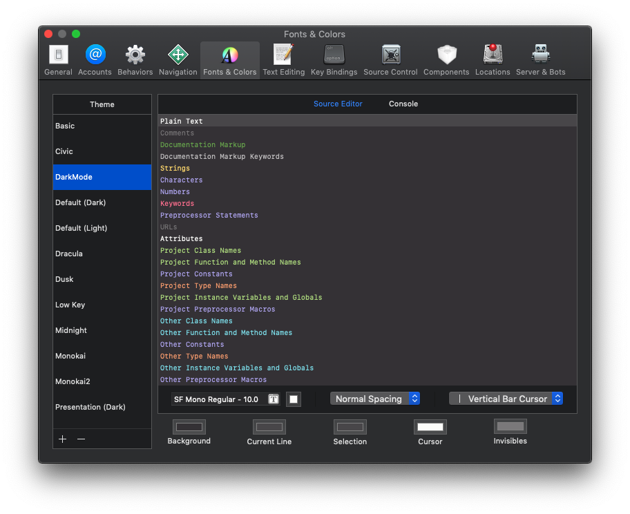

# Xcode Theme

An Xcode color theme optimized for macOS and/or Xcode in dark mode.

## Installation

1. Download and copy **DarkMode.xccolortheme** file
2. Open `~/Library/Developer/Xcode/UserData/FontAndColorThemes/` folder
3. Paste the file right there
4. Reopen Xcode
5. Choose a new theme in preferences
6. Enjoy

## Color Scheme

    

## Screenshots

    
    

## Attributions

The theme is inspired by Xcode's _Default (Dark)_ theme, the original Monokai that shipped with [Sublime Text 2](https://www.sublimetext.com) and [Monokai Pro](https://www.monokai.pro).

The idea for the repo came from [@mozharovsky](https://github.com/mozharovsky) and his [WWDC17 Xcode Theme](https://github.com/mozharovsky/WWDC17-Xcode-Theme).